---
## Front matter
title: "Лабораторная работа №4"
subtitle: "дисциплина: Архитектура компьютера"
author: "Серёгина Ирина Андреевна"

## Generic otions
lang: ru-RU
toc-title: "Содержание"

## Bibliography
bibliography: bib/cite.bib
csl: pandoc/csl/gost-r-7-0-5-2008-numeric.csl

## Pdf output format
toc: true # Table of contents
toc-depth: 2
lof: true # List of figures
lot: true # List of tables
fontsize: 12pt
linestretch: 1.5
papersize: a4
documentclass: scrreprt
## I18n polyglossia
polyglossia-lang:
  name: russian
  options:
	- spelling=modern
	- babelshorthands=true
polyglossia-otherlangs:
  name: english
## I18n babel
babel-lang: russian
babel-otherlangs: english
## Fonts
mainfont: PT Serif
romanfont: PT Serif
sansfont: PT Sans
monofont: PT Mono
mainfontoptions: Ligatures=TeX
romanfontoptions: Ligatures=TeX
sansfontoptions: Ligatures=TeX,Scale=MatchLowercase
monofontoptions: Scale=MatchLowercase,Scale=0.9
## Biblatex
biblatex: true
biblio-style: "gost-numeric"
biblatexoptions:
  - parentracker=true
  - backend=biber
  - hyperref=auto
  - language=auto
  - autolang=other*
  - citestyle=gost-numeric
## Pandoc-crossref LaTeX customization
figureTitle: "Рис."
tableTitle: "Таблица"
listingTitle: "Листинг"
lofTitle: "Список иллюстраций"
lotTitle: "Список таблиц"
lolTitle: "Листинги"
## Misc options
indent: true
header-includes:
  - \usepackage{indentfirst}
  - \usepackage{float} # keep figures where there are in the text
  - \floatplacement{figure}{H} # keep figures where there are in the text
---

# Цель работы

Целью работы является освоение процедуры оформления отчетов с помощью
легковесного языка разметки Markdown

# Задания

1) Установить необходимое ПО
2) Выполнить лабораторную работу 
3) Выполнить задание для самостоятельной работы

# Установка ПО

1.Я открываю терминал, по ссылке с официального сайта скачиваю архив, затем распаковываю его, перехожу в полученную папку, там запускаю скрипт с правами root, после установки добавляю usr/local/texlive/2022/bin/x86_64-linux в мой PATH (рис. [-@fig:001])

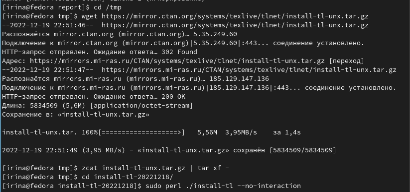{ #fig:001 width=70% }

2.Скачиваю архив pandoc (рис. [-@fig:002])

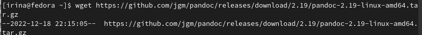{ #fig:002 width=70% }

3.Скачиваю архив pandoc-crossref (рис. [-@fig:003])

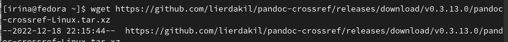{ #fig:003 width=70% }

4.Распаковываю архивы (рис. [-@fig:004])

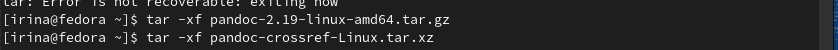{ #fig:004 width=70% }

5.Копирую файлы pandoc и pandoc-crossref в каталог /usr/local/bin/, потом проверяю себя с помощью ls (рис. [-@fig:005])

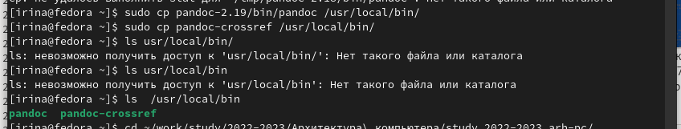{ #fig:005 width=70% }

# Выполнение лабораторной работы

1.Открываю терминал, перехожу в каталог курса и обновляю локальный репозиторий, однако в этом нет необходимости, затем перехожу в каталог с шаблоном отчёта по лабораторной работе № 4 (рис. [-@fig:006])

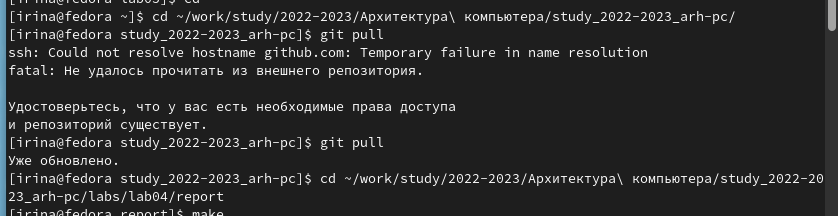{ #fig:006 width=70% }

2.Компилирую шаблон отчёта с использованием Makefile командой make, с ls помощью проверяю, создались ли необходимые файлы (рис. [-@fig:007])

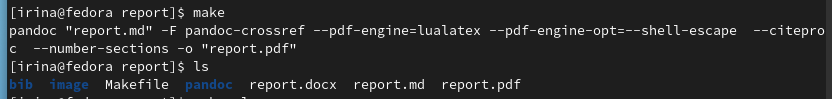{ #fig:007 width=70% }

3.Удаляю ненужные файлы с использованием Makefile командой make clean, с ls помощью проверяю, удалились ли необходимые файлы (рис. [-@fig:008])

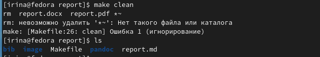{ #fig:008 width=70% }

4.С помощью gedit report.md открываю файл в текстовом редакторе и изучаю структуру, потом начинаю заполнять шаблон для создания отчёта по данной лабораторной (рис. [-@fig:009])

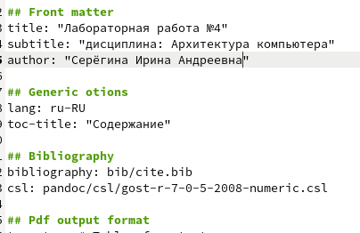{ #fig:009 width=70% }

5.Добавляю файлы на git hub

#Задание для самостоятельной работы

Я сдаю эту лабораторную работу позже, чем третью из-за того, что мне пришлось переустанавливать виртуальную машину, поэтому у меня не сохранились скриншоты из терминала, но сохранился шаблон отчета, поэтому я прикреплю его скриншот (рис. [-@fig:010]) рис. ([-@fig:011]) 

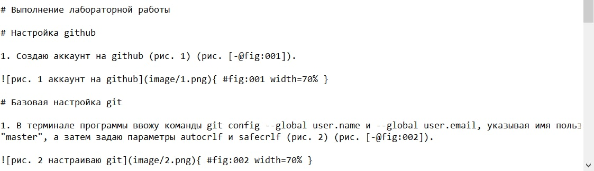{ #fig:010 width=70% }
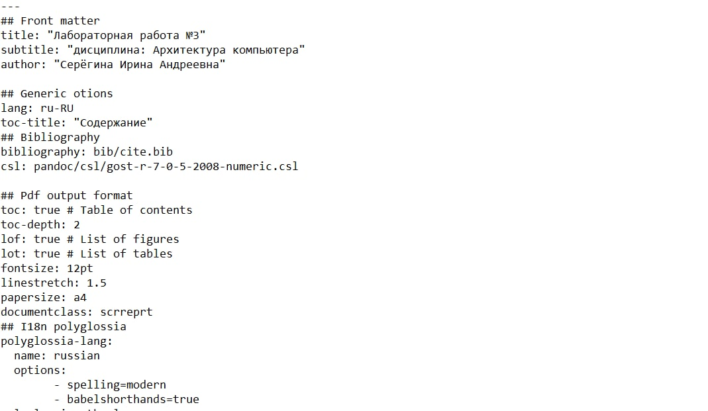{ #fig:011 width=70% }

# Выводы

Я освоила процедуры оформления отчетов с помощью легковесного языка разметки Markdown

# Список литературы{.unnumbered}

::: {#refs}
:::
